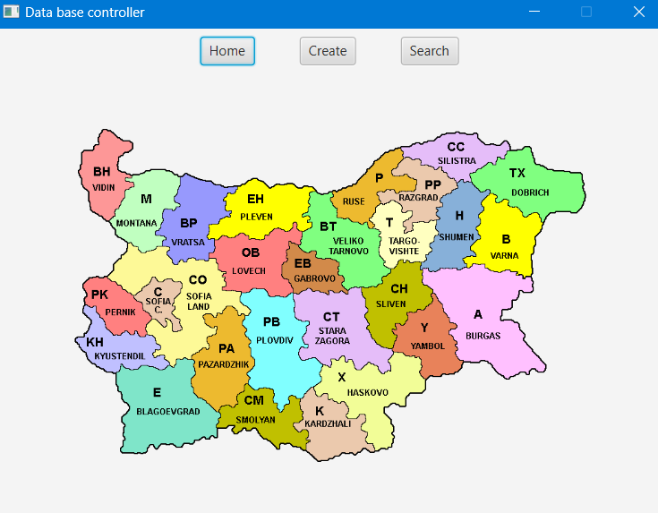
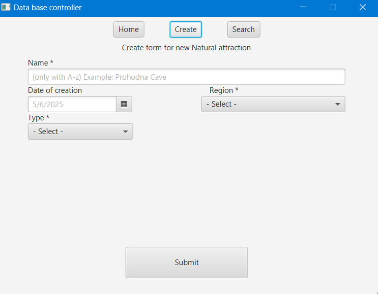
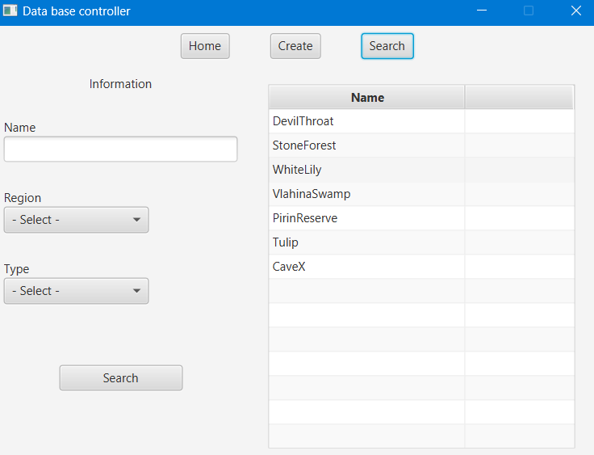
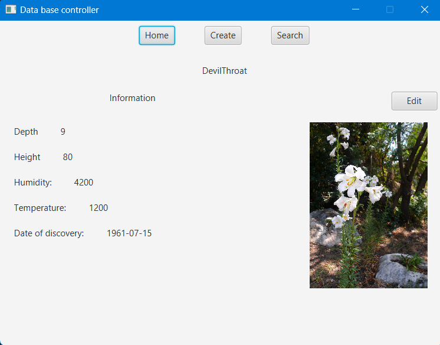

# Java FXML app working with Data base
It does have option to search and navigate through some simple menus.

The data base is about "Bulgarian natural attraction" which are 
defined by their type: "Plant, Cave, Rock formation, Swamp and Reserve"
and their region. Also every type of data has it's own added fields.

About missing parts:
 -Inserting new data for specific table\
 -Editing existing one thorugh the "Edit" button

 =============================================================================  
 
 

 

 

 
